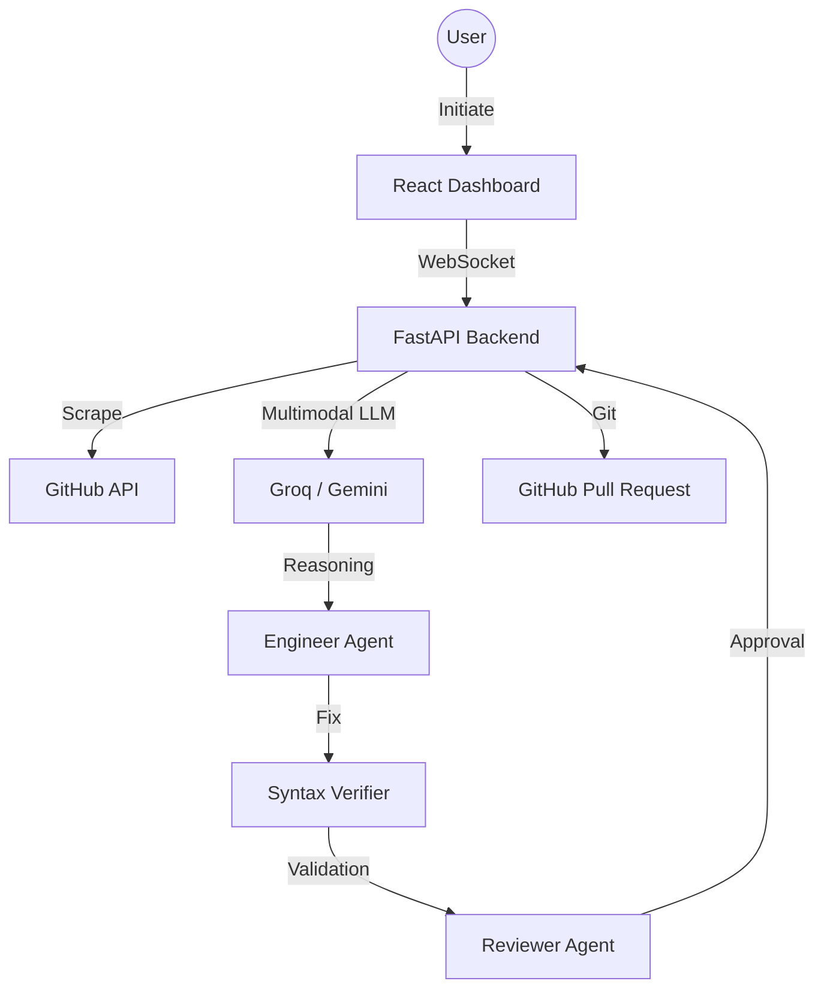

# DevBounty: The Autonomous Open-Source Engineering Agent

**DevBounty** is a professional-grade autonomous system designed to find, analyze, and fix open-source bugs in real-time. Built for high-speed engineering pipelines, it leverages multi-agent orchestration to provide end-to-end bug resolution with human-level reasoning.


## Key Features

- **Target Acquisition:** Scans GitHub for "good first issues" across Python, JS, and TS.
- **Multi-Agent Pipeline:**
    - **Engineer Agent:** Analyzes the bug and writes the fix.
    - **Syntax Verifier:** Ensures the code is parseable and valid.
    - **Senior Reviewer Agent:** Critiques the fix and requests refinements.
- **Real-time Streaming:** "God Mode" terminal provides a live look into the AI's reasoning.
- **Premium UI:** Cyberpunk-inspired dashboard built with React and Framer Motion.
- **One-Click PR:** Automatically clones, fixes, and submits Pull Requests.

## Architecture



## Quick Start

### 1. Prerequisites
- **Python 3.10+**
- **Node.js 18+**
- **GitHub PAT** (with `repo` scope)

### 2. Environment Setup
Create a `.env` file in the `backend/` directory:
```env
AI_PROVIDER=groq
AI_MODEL=llama-3.3-70b-versatile
GROQ_API_KEY=your_groq_key
GITHUB_API_TOKEN=your_github_pat
```

**Running fully local with Ollama instead:**
```bash
ollama pull qwen2.5:7b
ollama serve
```
```env
AI_PROVIDER=ollama
AI_MODEL=qwen2.5:7b
OLLAMA_BASE_URL=http://localhost:11434/v1
OLLAMA_NUM_CTX=8192
GITHUB_API_TOKEN=your_github_pat
```
No API key is required for Ollama. `OLLAMA_NUM_CTX` controls the context window sent to the model — raise it if you see truncated analysis on larger files.

### 3. Installation

**Backend Setup:**
```bash
# From the project root:
python -m venv venv

# Activate (Windows)
venv\Scripts\activate
# Activate (Mac/Linux)
source venv/bin/activate

# Install requirements
pip install -r backend/requirements.txt
```

**Frontend Setup:**
```bash
# Build the production dashboard
cd frontend-react
npm install
npm run build
npm run dev
```

### 4. Running the App
Launch the integrated server from the `backend` directory:
```bash
cd backend
python main.py
```
> **Note:** Access the dashboard at `http://localhost:8000`

---
# Devbounty-


