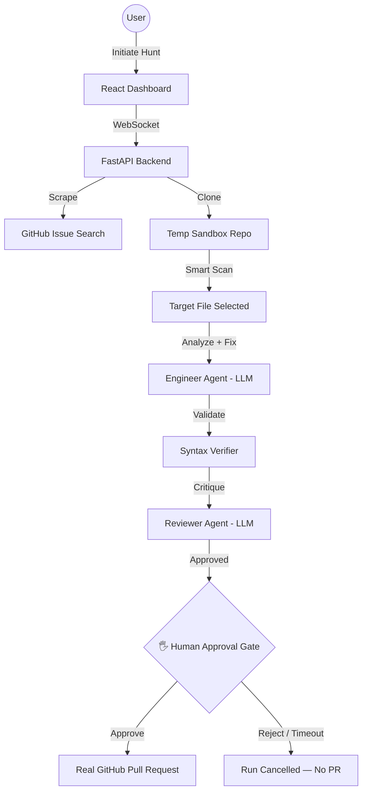

# DevBounty 🤖

**DevBounty** is an autonomous multi-agent system that finds real open-source bugs on GitHub, analyzes them, writes a fix, gets a second AI to review it, and — only after a **human explicitly approves the change** — opens a real pull request.

It's built around one core idea: an AI agent that touches other people's code shouldn't act completely unsupervised. Every fix is shown to a human before it ships.


---

## ✨ Key Features

- **Target Acquisition** — scans GitHub for "good first issue" / "bug" labeled issues in Python, JS, or TS.
- **Multi-Agent Pipeline**
  - **Engineer Agent** — analyzes the bug and writes the fix.
  - **Syntax Verifier** — confirms the fix parses correctly.
  - **Senior Reviewer Agent** — critiques the fix and can send it back for refinement.
- **🖐️ Human Approval Gate** — before any PR is opened, the diff and the AI's reasoning are shown to a human. Nothing ships without an explicit Approve.
- **Real-time Streaming** — a live "God Mode" terminal shows the agent's reasoning as it happens, over WebSockets.
- **Real Usage Metrics** — token counts and cost shown in the dashboard come from actual API responses, not placeholders.
- **Pluggable AI Backend** — run on **Groq** (fast, generous free tier), a fully **local Ollama** model (zero cost, offline), or **Gemini** — swap providers via one environment variable, no code changes.

---

## 🧭 How It Works



Every hunt goes through seven stages, streamed live to the dashboard:

1. **Scrape** — find an open "good first issue" bug matching your selected language.
2. **Clone** — shallow-clone the target repo into a temporary sandbox.
3. **Smart Scan** — identify the most likely source file for the bug.
4. **Analyze** — the Engineer Agent explains what's wrong.
5. **Fix** — the same agent writes the fix.
6. **Verify + Review** — a syntax check, then a second AI agent reviews the fix (can loop back for revisions).
7. **Approve → PR** — a human reviews the diff in the dashboard; only on approval does a real PR go out. Reject or a 15-minute timeout cancels the run — no PR is opened.

---

## 🚀 Quick Start

### 1. Prerequisites
- **Python 3.10 – 3.12** (3.13+ has known compatibility issues with some dependencies)
- **Node.js 18+**
- **A GitHub Personal Access Token** with `repo` scope ([create one here](https://github.com/settings/tokens))
- **A free Groq API key** ([console.groq.com](https://console.groq.com)) — or a local [Ollama](https://ollama.com) install if you'd rather run fully offline

### 2. Environment Setup
Create a `.env` file inside `backend/`:

```env
AI_PROVIDER=groq
AI_MODEL=openai/gpt-oss-120b
GROQ_API_KEY=your_groq_key
GITHUB_API_TOKEN=your_github_pat
```

> ⚠️ `AI_MODEL` matters — Groq periodically deprecates older models (e.g. `llama-3.3-70b-versatile` was retired). Check [Groq's model list](https://console.groq.com/docs/models) if you get a `404 model does not exist` error.

**Prefer to run fully local instead?**
```bash
ollama pull qwen2.5-coder:7b
ollama serve
```
```env
AI_PROVIDER=ollama
AI_MODEL=qwen2.5-coder:7b
OLLAMA_BASE_URL=http://localhost:11434/v1
OLLAMA_NUM_CTX=8192
GITHUB_API_TOKEN=your_github_pat
```
No API key needed for Ollama. `qwen2.5-coder:7b` (code-tuned) is recommended over the base `qwen2.5:7b` for better fix quality at the same hardware cost. Raise `OLLAMA_NUM_CTX` if you see truncated analysis on larger files.

### 3. Install & Run — Backend
```bash
python3 -m venv venv
source venv/bin/activate      # Windows: venv\Scripts\activate
pip install -r backend/requirements.txt

cd backend
python main.py
```
Backend runs at `http://localhost:8000`.

### 4. Install & Run — Frontend
In a separate terminal:
```bash
cd frontend-react
npm install
npm run dev
```
Open the URL Vite prints (usually `http://localhost:5173`).

### 5. Use It
Pick a language, click **Initiate Hunt**, and watch the God Mode terminal. When a fix is ready, an **approval modal** will appear showing the original code, the proposed fix, and the AI's analysis — review it and click **Approve** to open a real PR, or **Reject** to cancel.

---

## 🏗️ Architecture

**Backend** (`backend/`)
| File | Responsibility |
|---|---|
| `main.py` | Orchestrates the hunt pipeline, exposes REST + WebSocket endpoints, enforces the human approval gate |
| `agent.py` | `AIAgent` — unified interface over Groq / Ollama / Gemini, tracks real token usage |
| `scraper.py` | Searches GitHub's issue API for candidate bugs |
| `github_ops.py` | Clones repos, creates branches/commits, opens pull requests |

**Frontend** (`frontend-react/src/`)
| File | Responsibility |
|---|---|
| `App.jsx` | Top-level state, WebSocket connection, hunt lifecycle |
| `ApprovalModal.jsx` | Human-in-the-loop review screen before any PR is submitted |
| `MissionModal.jsx` | Post-run report — shows the diff, PR link, or cancellation reason |

---

## ⚠️ Known Limitations

Documented honestly so you know what to expect:

- Fixes currently overwrite the **entire target file**, not a targeted diff — risky on large files.
- The syntax verifier only checks **Python** (`ast.parse`); JS/TS fixes get no automated syntax check before human review.
- No automated test-suite execution — verification relies on the AI reviewer and your own judgment at the approval gate.
- No persistent run history (lives in browser state only).
- CORS is wide open and there's no API-key auth on the hunt-trigger endpoint — fine for local use, **needs hardening before any public deployment**.

## 🛣️ Roadmap

- [ ] Diff-based patching instead of whole-file overwrite
- [ ] Run the target repo's real test suite before showing the fix for approval
- [ ] Persist run history to a lightweight database
- [ ] Basic auth on hunt-trigger endpoint + scoped CORS

---

## 🧰 Tech Stack

`FastAPI` · `Uvicorn` · `WebSockets` · `PyGithub` · `openai` SDK (Groq + Ollama compatible) · `google-generativeai` · `React 18` · `Vite` · `Tailwind CSS` · `Framer Motion`

---

## 🤝 Contributing

Issues and PRs welcome — especially around the limitations listed above. If you add a new AI provider, follow the pattern in `agent.py`'s `_call()` method to keep the interface consistent.

## 📄 License

Add your license here (MIT recommended if you intend this to be publicly forkable).
